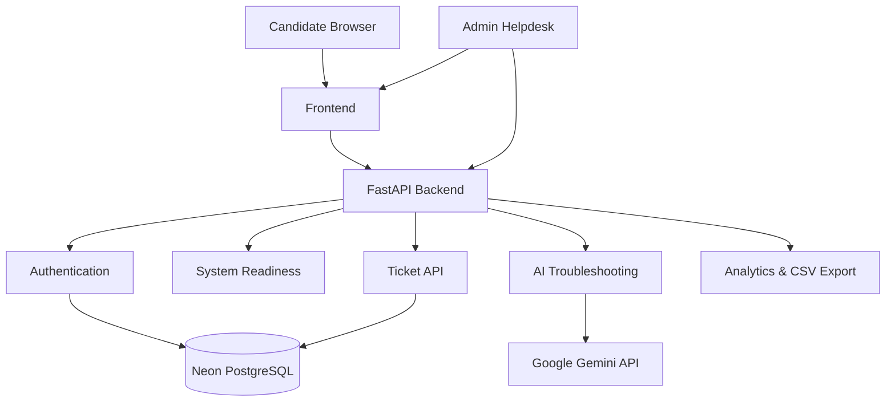

# HireReady TechCheck

**AI-Powered Interview Readiness & Technical Support Platform**

HireReady TechCheck is an independent full-stack concept prototype designed to reduce technical failures before and during online interviews.

**Live Demo:** https://hireready-techcheck.onrender.com

> Independent concept prototype. Not affiliated with any employer, recruitment platform, or company.

## Problem

Online interviews can fail because of camera, microphone, browser, network, audio, system-performance, or assessment-portal issues. HireReady TechCheck combines readiness checks, AI troubleshooting, and helpdesk escalation in one workflow.

## Core Features

### Candidate Portal
- Candidate registration and login
- Internet, camera, microphone, browser, device, and display checks
- Interview readiness score
- Gemini AI troubleshooting
- Likely-cause analysis and step-by-step fixes
- AI-assisted priority classification
- Support ticket creation
- Candidate ticket history

### Admin / Helpdesk Portal
- Admin login
- Support queue
- High / Medium / Low priority
- AI-generated support summaries
- Search and filters
- Resolve workflow
- Support metrics
- CSV export

## Technology Stack

**Backend:** Python, FastAPI, REST APIs, Uvicorn  
**Frontend:** HTML5, CSS3, JavaScript, browser MediaDevices APIs  
**AI:** Google Gemini API with structured responses  
**Database:** PostgreSQL, Neon, SQLAlchemy  
**Deployment:** Render, GitHub, environment-variable based secrets

## Architecture



## Workflow

```text
Candidate
  ↓
Register / Login
  ↓
Run TechCheck
  ↓
Readiness Score
  ↓
Describe Technical Problem
  ↓
Gemini AI Diagnosis
  ↓
Troubleshooting Steps
  ↓
Unresolved?
  ↓
Create Support Ticket
  ↓
Neon PostgreSQL
  ↓
Admin Helpdesk Dashboard
  ↓
Resolve Ticket
```

## AI Safety Design

The AI is limited to legitimate technical support. It is instructed not to bypass employer security, authentication, proctoring, monitoring, assessment restrictions, or anti-cheating systems, and not to request passwords, OTPs, tokens, or confidential employer data.

## Example AI Scenario

**Problem:** My microphone works in Windows settings, but the recruiter cannot hear me in Chrome and my interview starts in 15 minutes.

The AI can return:
- Category: Microphone
- Priority: High
- Likely cause
- Browser permission checks
- Correct input-device verification
- Background application checks
- Escalation guidance

## Ticket Priority Logic

Priority considers both interview urgency and AI severity.

```text
≤ 30 minutes → High
≤ 3 hours → Medium
Later → Low
```

The higher priority between time-based urgency and AI classification is used.

## Cloud Deployment

```text
User
  ↓
Render
  ↓
FastAPI Application
  ├── Google Gemini API
  └── Neon PostgreSQL
```

Sensitive values such as API keys and database credentials are configured through environment variables and are not committed to source code.

## What I Learned

- Python backend development
- FastAPI and REST APIs
- Authentication workflows
- Password hashing
- PostgreSQL and SQLAlchemy
- Browser APIs
- AI API integration
- Structured AI responses
- Ticketing workflows
- Cloud deployment
- Environment variables
- Render port-binding troubleshooting
- Persistent cloud database configuration
- GitHub project management

## Future Improvements

- Email verification and password reset
- Multi-company support
- Agent assignment
- Ticket comments
- SLA tracking
- Audit logs
- Rate limiting
- Database migrations
- Monitoring and observability
- Richer analytics
- Custom company branding

## Project Positioning

This project demonstrates a practical combination of:

**IT Support + Full-Stack Development + AI Integration + Cloud Deployment**

Relevant roles include IT Support Engineer, Technical Support Engineer, Desktop Support, Helpdesk Support, IT Operations, Junior System Administration, Technical Customer Support, and entry-level Python/backend roles.

## Disclaimer

HireReady TechCheck is an **independent concept prototype** created for portfolio and educational purposes. It is not affiliated with, commissioned by, endorsed by, or officially connected to any employer, interview platform, or recruitment company.
